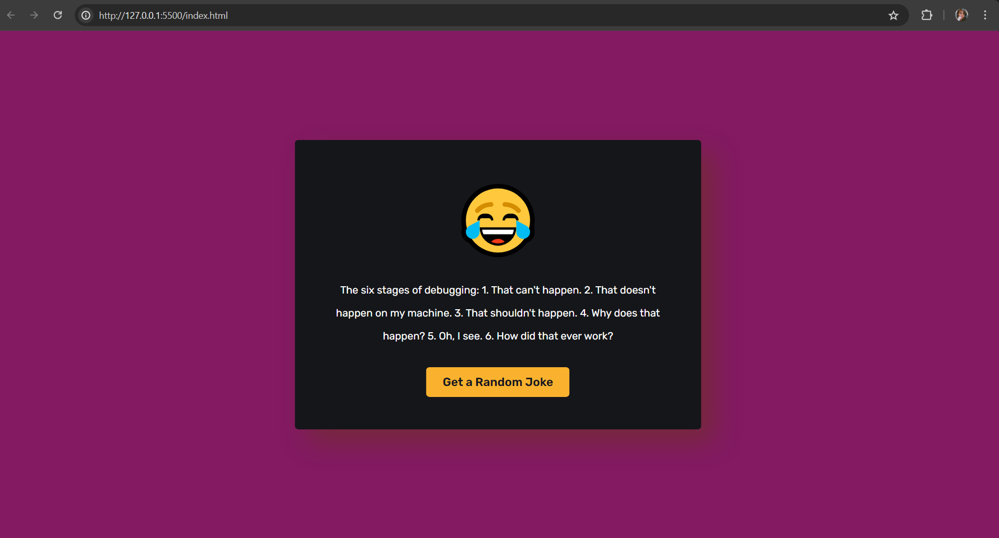

# Joke_generator
A lighthearted and interactive web application built with JavaScript that delivers a dose of laughter on demand.

# Functionalities:

1. Fetches Jokes from External API: Leverages a third-party joke API (like https://sv443.net/jokeapi/v2/) to retrieve a vast collection of jokes, ensuring a continuous stream of humor.
2. Random Joke Generation: Generates a random joke upon user interaction (e.g., button click) or automatically at set intervals, keeping the fun fresh.
3. Display and Styling: Presents the retrieved joke in a user-friendly format, optionally incorporating CSS for visual appeal. (Customization possibilities are endless!)

#Benefits:

1. Provides Entertainment: Enhances your web presence with a fun and engaging feature, perfect for break rooms, personal projects, or interactive websites.
2. Learning Opportunity: Demonstrates the power of JavaScript by integrating with an external API and manipulating data.
3. Customization Potential: Offers a solid foundation for further development, allowing you to add features like joke filtering, categories, or user accounts.

# Getting Started:

1. Clone the repository.
2. Run the live server and start telling jokes!

